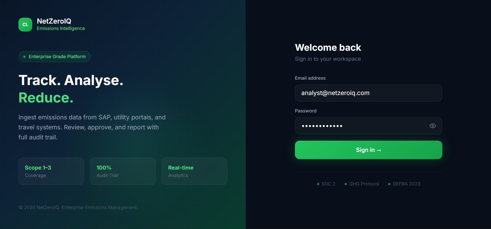
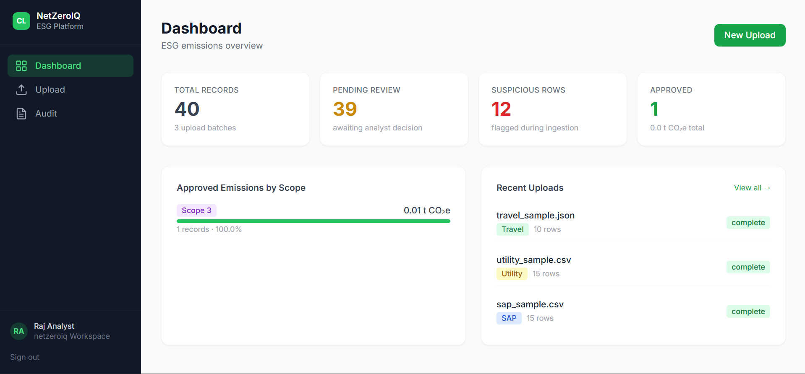
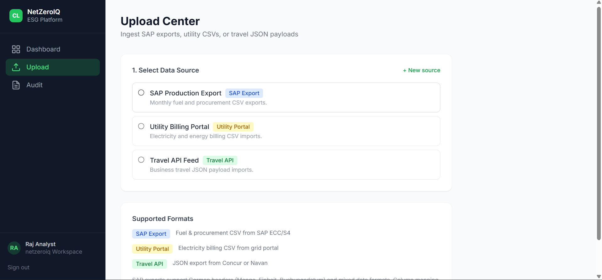
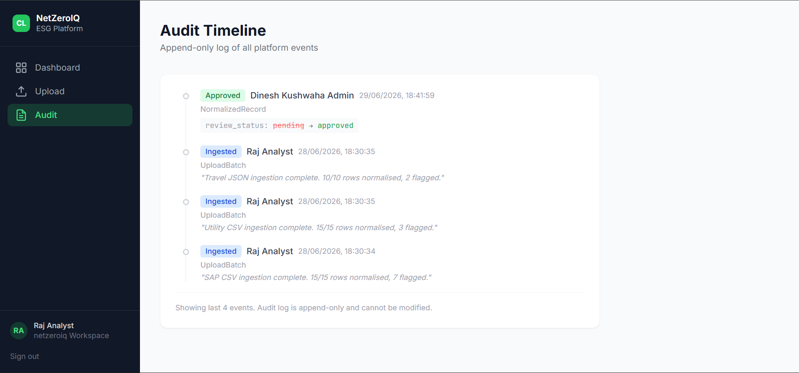
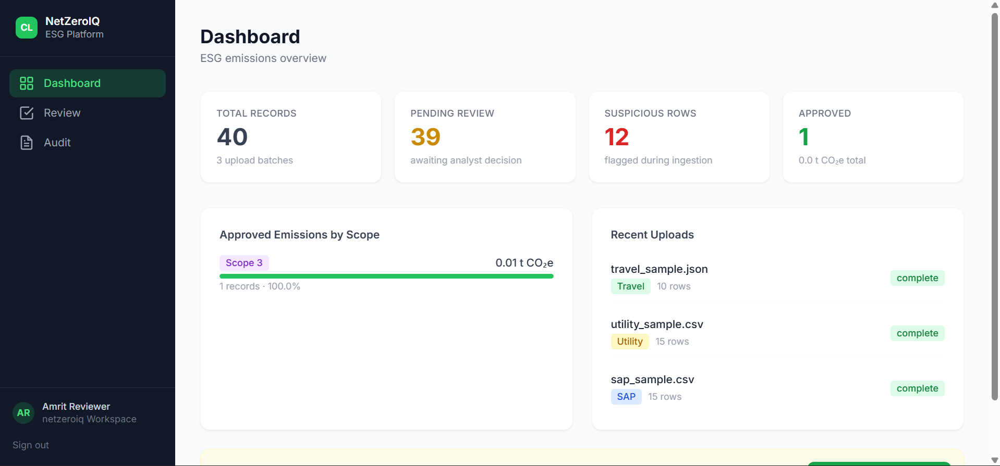
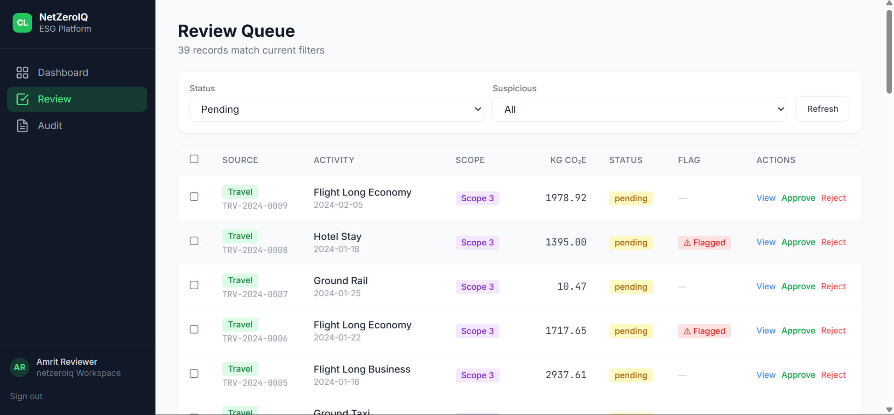
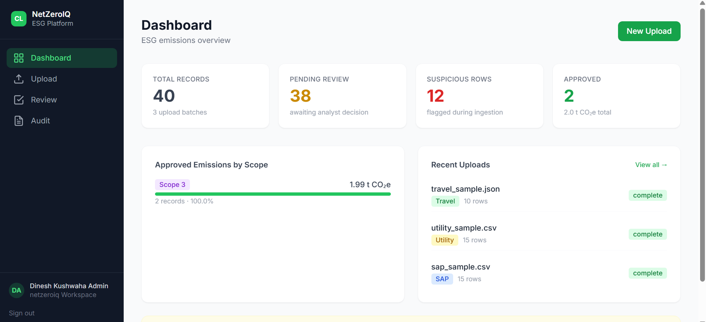
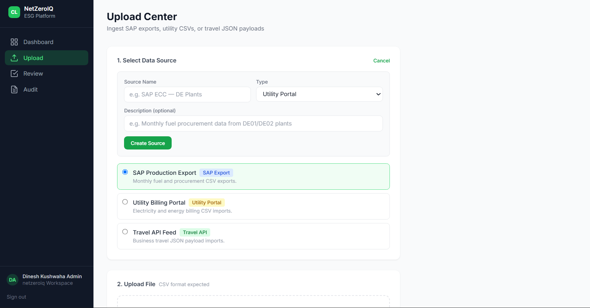
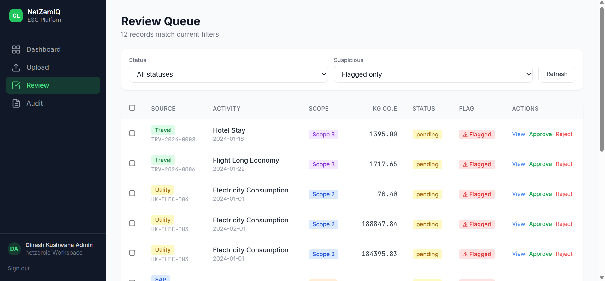
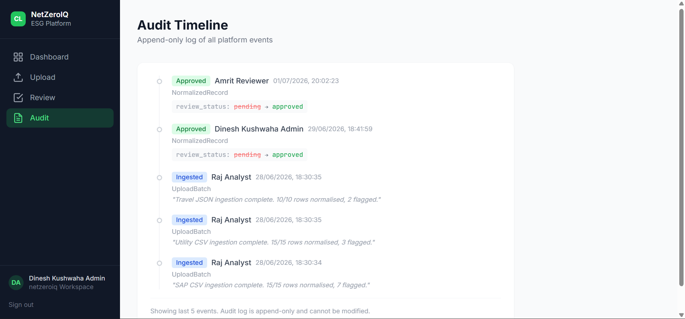

<div align="center">


# 🌿 NetZeroIQ

### Enterprise Emissions Management Platform

*Ingest · Normalize · Review · Audit — every CO₂e record, end-to-end.*

<br/>

[](https://spring.io/projects/spring-boot)
[](https://openjdk.org/)
[](https://react.dev/)
[](https://www.postgresql.org/)
[](https://www.docker.com/)
[](LICENSE)

<br/>
[Live Demo](https://net-zero-iq-carbon-emissions-manage.vercel.app/) · [Application Preview](#-project-preview) · [Report Bug](mailto:dineshkushwaha1312@gmail.com) · [Project Structure](#-project-structure) · [](https://www.linkedin.com/in/mrdinesh-kushwaha/)

</div>

---

## 📖 Overview

**netzeroiq** is a multi-tenant ESG emissions tracking platform built for enterprise use. It ingests data from **SAP exports**, **utility portals**, and **travel booking systems** (Concur/Navan), normalizes everything into CO₂e figures, and routes records through a structured **review-and-approval workflow** with a full audit trail.

---
# Project Preview

### 🔑 Authentication
| Login |
|--------|
| 
 
### 👤 Analyst Role
| Dashboard | File upload |
|-----------|----------|
|  |  |
 
| Audit | |
|-------|--|
|  | |
 
### 🛡️ Reviewer Role
| Dashboard | Review |
|-----------|----------|
|  |  |

### 👑 Admin Role
 
|Dashboard | File upload |
|----------|-------------|
|  |  |

| Review | Audit |
|--------|-------|
|  |  |

---

## 🔑 Application Credentials

> Credentials are force-verified on every backend startup — no stale password issues.

| Role | Email | Password |
|---|---|---|
| **Analyst** | `analyst@netzeroiq.com` | `analyst@1234` |
| **Reviewer** | `reviewer@netzeroiq.com` | `reviewer@1234` |
| **Admin** | `dinesh@netzeroiq.com` | `dinesh@1234` |

---

## ✨ Features

| Feature | Description |
|---|---|
| 🔐 **JWT Auth & RBAC** | Access + Refresh token flow with role-based permissions |
| 📊 **ESG Dashboard** | Carbon analytics and emissions insights at a glance |
| 📁 **Multi-format Ingestion** | SAP CSV · Utility CSV · Travel JSON |
| ✅ **Review Workflow** | Single & bulk approve/reject with decision tracking |
| 🧾 **Full Audit Trail** | Tenant-scoped and record-level audit log |
| 👥 **3 User Roles** | Analyst · Reviewer · Admin |
| 🗄️ **Dual DB Support** | H2 for development · PostgreSQL for production |
| 🐳 **Deploy Ready** | Docker + Render.com out of the box |

---

## 🏗️ Tech Stack

| Layer | Technology |
|---|---|
| **Backend** | Java 21 + Spring Boot 3.2.1 |
| **Auth** | JWT (JJWT 0.12) via Spring Security |
| **Database** | PostgreSQL 15 (prod) · H2 (dev) via Spring Data JPA |
| **Frontend** | React 18 + Vite + Tailwind CSS |
| **CSV Parsing** | OpenCSV |
| **Deployment** | Docker · Render.com |

---

## 📁 Project Structure

```
netzeroiq/
├── backend/
│   ├── pom.xml
│   └── src/main/java/com/netzeroiq/
│       ├── netzeroiqApplication.java
│       ├── config/          # Security, CORS, Jackson, exception handler
│       ├── controller/      # REST controllers
│       ├── dto/             # Request/response DTOs
│       ├── model/           # JPA entities
│       ├── repository/      # Spring Data repositories
│       ├── security/        # JWT filter + util
│       └── service/         # Normalization, ingestion, audit logic
├── frontend/
│   ├── src/
│   │   ├── api/client.js
│   │   ├── components/Layout.jsx
│   │   ├── hooks/useAuth.jsx
│   │   └── pages/
│   │       ├── LoginPage.jsx
│   │       ├── DashboardPage.jsx
│   │       ├── UploadCenterPage.jsx
│   │       ├── ReviewQueuePage.jsx
│   │       ├── RecordDetailPage.jsx
│   │       └── AuditTimelinePage.jsx
│   └── package.json
├── sample_data/
│   ├── sap_sample.csv
│   ├── utility_sample.csv
│   └── travel_sample.json
└── docs/
```

---

## 🚀 Local Development

### Prerequisites

- Java 21 (via SDKMAN: `sdk install java 21-tem`)
- Maven 3.9+
- Node.js 20+
- PostgreSQL 15+

### Backend Setup

```bash
cd backend

# Create the database
createdb netzeroiq

# Set environment variables
export DB_USER=postgres
export DB_PASSWORD=your_password
export JWT_SECRET=your-secret-key-min-32-chars-long-here

# Start the server
./mvnw spring-boot:run
# API available at → http://localhost:8000
```

### Frontend Setup

```bash
cd frontend

cp .env.example .env
# Edit .env → VITE_API_BASE_URL=http://localhost:8000

npm install
npm run dev
# App available at → http://localhost:5173
```

---

## 🔌 API Reference

| Method | Endpoint | Description |
|---|---|---|
| `POST` | `/api/auth/login` | Login — returns JWT access + refresh token |
| `POST` | `/api/auth/refresh` | Refresh access token |
| `GET` | `/api/auth/me` | Current authenticated user |
| `GET` | `/api/dashboard/stats` | Dashboard aggregates |
| `GET` | `/api/data-sources` | List tenant data sources |
| `POST` | `/api/data-sources` | Create data source |
| `GET` | `/api/batches` | List upload batches |
| `GET` | `/api/batches/{id}` | Single batch detail |
| `POST` | `/api/upload/sap` | Upload SAP CSV |
| `POST` | `/api/upload/utility` | Upload utility CSV |
| `POST` | `/api/upload/travel` | Upload travel JSON |
| `GET` | `/api/records` | List normalized records (filterable) |
| `GET` | `/api/records/{id}` | Single record detail |
| `POST` | `/api/records/{id}/review` | Review single record |
| `POST` | `/api/records/bulk-review` | Bulk approve / reject |
| `GET` | `/api/decisions` | List review decisions |
| `GET` | `/api/audit` | Tenant-scoped audit log |
| `GET` | `/api/records/{id}/audit` | Record-level audit trail |

---

## 🌍 Emission Factors

> Based on **DEFRA 2023** / **IEA 2022** approximations. See `NormalizationService.java` for the full table.

| Source | Factor | Unit |
|---|---|---|
| Diesel combustion | `2.6391` | kg CO₂e / litre |
| Electricity (UK grid) | `0.20707` | kg CO₂e / kWh |
| Economy flight (short-haul) | `0.15530` | kg CO₂e / passenger-km |
| Hotel stay | `31.0` | kg CO₂e / room-night |

---

## 👥 User Roles

| Role | Upload | Review | Dashboard & Audit |
|---|:---:|:---:|:---:|
| `analyst` | ✅ | ❌ | ✅ |
| `reviewer` | ❌ | ✅ | ✅ |
| `admin` | ✅ | ✅ | ✅ |

---

## 📄 License

This project is licensed under the **MIT License** — see the [LICENSE](LICENSE) file for details.

---

## 👨‍💻 Author

Developed with ❤️ by **Dinesh Kushwaha**

[](https://www.linkedin.com/in/mrdinesh-kushwaha/)

---
<div align="center">

Made with 🌿 by **netzeroiq Inc.** © 2026

*If you found this useful, drop a ⭐ on GitHub!*

</div>
